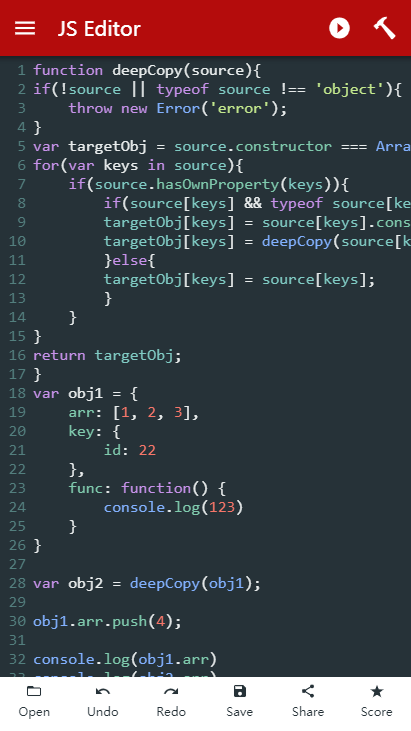

# JSEditor


JavaScript Editor for web/android/iOS. JSEditor is an offline JavaScript editor. With JSEditor, you can write, run, debug, save and read local JS files in JavaScript anytime, anywhere. Supports 19 languages including Chinese, Korean, Vietnamese, Thai, Japanese, Russian, Dutch, French, Italian, Arabic, Ukrainian, and Spanish. It supports mobile phone and tablet. At present, JSEditor has 16 built-in running examples. I wish you a happy use. If you have any better suggestions, please contact me, thank you.

[Download APP](https://play.google.com/store/apps/details?id=com.tao.jseditor)

Preview image



## install

```bash
npm install
```

## run

```bash
npm start
```

## build

Make sure ionic and cordova is installed on your computer

- Build develop package

  ```bash
  ionic cordova build android
  ```

- Build prodction package

  ```bash
  ionic cordova build android --prod
  ```

- Build release package

  ```bash
  ionic cordova build android --prod --release
  ```

- Sign
  Generate signature file

  ```bash
  keytool -genkey -v -keystore key.keystore -alias aliasName -keyalg RSA -keysize 2048 -validity 10000
  ```

  You can modify alias 'aliasName' to any words

  set your password

  JKS key to PKCS12 key

  ```bash
  keytool -importkeystore -srckeystore key.keystore -destkeystore key.keystore -deststoretype pkcs12
  ```

- APK Sign
  Generate a new signed JSEditor_signed.apk file in the root directory

  ```bash
  # aliasName is sign aliasName
  jarsigner -verbose -keystore ./release-key.jks -signedjar JSEditor_signed.apk ./platforms/android/app/build/outputs/apk/release/app-release-unsigned.apk aliasName -tsa <http://sha256timestamp.ws.symantec.com/sha256/timestamp>
  ```
